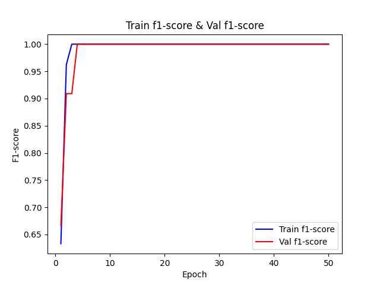
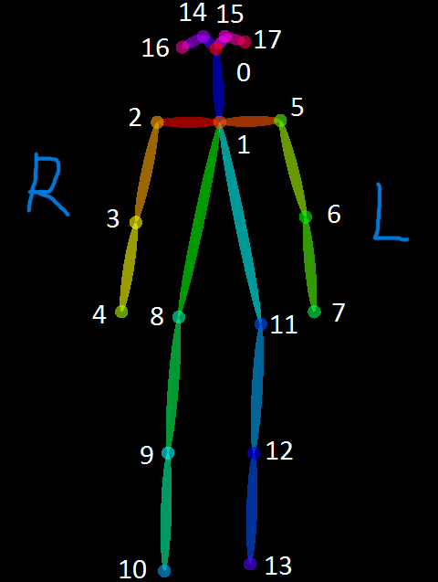
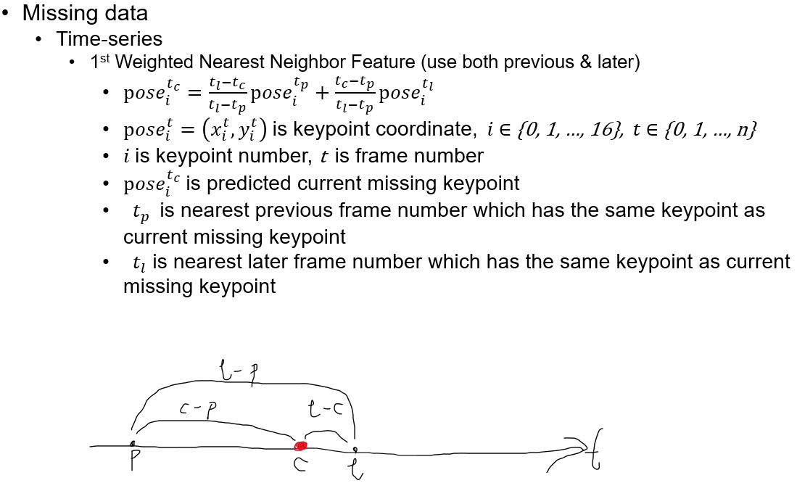
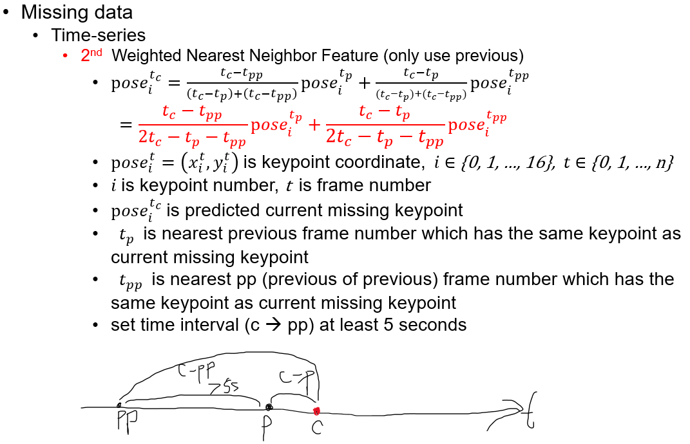
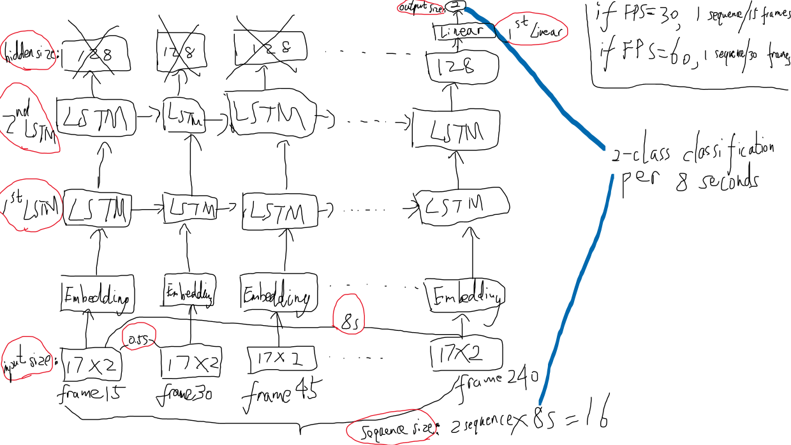

# DanceClassificationViaImage
In our previous work [EpilepticSeizureDetectionViaEEG](https://github.com/Yaphet-Zhang/EpilepticSeizureDetectionViaEEG), we successfully detected the seizures in real time using EEG highly accurately. On the other hand, considering the inconvenience of wearing EEG devices, using non-contact cameras is a good way.

In this work, since we cannot install surveillance cameras in the hospital, we try to propose a method to detect a simpler movement than seizures detection, that is, dancing. (the video below has a delay of about 4 seconds)




### Proposed method
- Pose Estimation
    - Firstly, we use deep learning algorithms [OpenPose](https://arxiv.org/pdf/1812.08008.pdf) to estimate the keypoints of human bones.



- Missing keypoints
    - Secondly, due to the missing value of keypoints, we propose the following 2 methods to fill them. 




- Time series data classification
    - Thirdly, we optimized the keypoints (see dataset.py for details) and fed them into LSTM for training classifier.




# Usage
### Dependencies
```
python=3.8
pytorch 
torchvision
cudatoolkit=11.3
ipykernel
numpy
opencv-python
Pillow
matplotlib
scipy
scikit-learn
ffmpeg (must install via conda firstly, then install via pip sencondly. If not, ffmpeg.probe will be error)
ffmpeg-python
pandas
```

### Datasets
- For training OpenPose, we can download the [annotation](https://www.dropbox.com/s/0sj2q24hipiiq5t/COCO.json?dl=0), [mask](https://www.dropbox.com/s/bd9ty7b4fqd5ebf/mask.tar.gz?dl=0), and [pre-trained model](https://www.dropbox.com/s/5v654d2u65fuvyr/pose_model_scratch.pth?dl=0).

```
./weights/pose_model_scratch.pth
```

- For getting the dance-class label of keypoints, we downloaded [AIST++ Dataset](https://google.github.io/aistplusplus_dataset/download.html).

```
AIST_downloader.py
dataset_dance.py
AIST_dance
```

- For getting the non-dance-class label of keypoints, we created and annotated our own datasets.
```
dataset_no_dance.py
custom_no_dance
```


### Train, valid
```
train_val.py
```

### Demo
```
inference_camera.py
```


